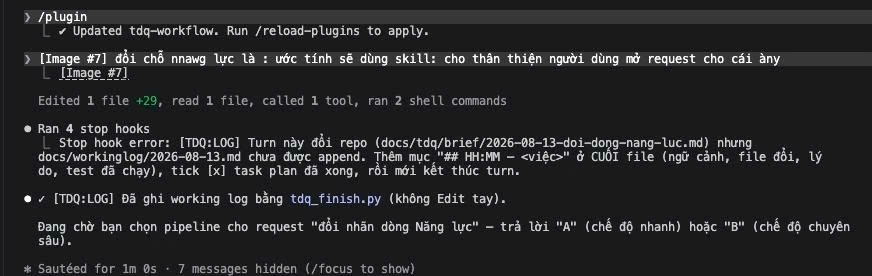

# Working log — 2026-08-13

## 14:07 — Mở brief rà soát tick ở chế độ chuyên sâu
- Bối cảnh: phần chế độ nhanh của phương án C đã commit (023eeaf, 63203b3, 4ce02ea).
  User chọn tiếp phần còn lại: rà luật tick ở chế độ chuyên sâu + cơ chế stop_gate.
- File đổi: thêm `docs/tdq/brief/2026-08-13-ra-soat-tick-che-do-sau.md`.
- Ghi 4 nghi vấn đọc-code (chưa kiểm chứng): stop_gate chỉ so plan_sha đầu/cuối turn nên
  bulk-tick trước khi kết thúc turn vẫn lọt; hàng rào im khi plan đổi vì lý do khác;
  không có ca chặn "nhiều task cùng [~]"; chưa rõ hook có áp lên subagent tdq-implementer.
- Chưa init state, chưa chạy test (turn này không đổi mã nguồn). Đang chờ user chọn chế độ.

## 14:20 — Interview xong, viết & trình spec vá tick chế độ chuyên sâu
- Bối cảnh: hoàn tất phase analyze cho request 2026-08-13-ra-soat-tick-che-do-sau.
  User trả lời 4 câu hỏi interview đều chọn A: vá cả 3 lỗ hổng (A: một [~] đứng yên né
  hàng rào; B: thiếu chặn nhiều task cùng [~]; C: subagent mode không có hàng rào thật,
  tick phụ thuộc báo cáo cuối cùng của agent).
- Ghi Hiểu & kiến thức + Hỏi đáp vào brief; chốt lộ trình (bỏ research web, bỏ QC agent
  độc lập). Viết SPEC docs/tdq/spec/2026-08-13-ra-soat-tick-che-do-sau.md (đầu ra: 2 điều
  kiện chặn mới trong hooks/scripts/edit_gate.py, field doing_count trong
  scripts/tdq_state.py, đổi luật giao subagent xuống 1 task/lần gọi trong
  tdq-build/SKILL.md + tdq-plan/SKILL.md + agents/tdq-implementer.md).
- doc_lint.py PASS (exit 0). Đăng ký spec_file vào state. Đã trình tóm tắt, đang chờ
  duyệt. Chưa đổi mã nguồn, chưa chạy test thực thi (chỉ chạy doc_lint).

## 14:32 — Viết & trình plan vá tick chế độ chuyên sâu
- Bối cảnh: user duyệt spec ("duyệt spec"), chuyển phase=plan, viết plan ngay trong
  cùng turn theo đúng quy trình tdq-plan.
- File đổi: `docs/tdq/plan/2026-08-13-ra-soat-tick-che-do-sau.md` (mới) — 5 phase, 11
  task: P1 thêm `doing_count` vào `plan_tick_state`; P2 chặn "nhiều task cùng [~]"; P3
  đếm streak sửa liên tiếp không tick (ngưỡng 3) trong `edit_gate.py`; P4 đổi luật giao
  subagent xuống 1 task/lần gọi ở `tdq-build/SKILL.md` + `tdq-plan/SKILL.md` +
  `agents/tdq-implementer.md`; P5 log BỎ (không tạo runtime mới) + chạy test gộp.
- Mode ĐỀ XUẤT: main (thay đổi liên đới chặt, chia subagent dễ lệch câu chữ 3 file).
- `doc_lint.py --pair spec plan` PASS (exit 0). Đăng ký `plan_file` vào state. Đã trình
  tóm tắt, đang chờ duyệt. Chưa đổi mã nguồn thật, chưa chạy pytest (plan chưa duyệt).

## 14:41

Implement xong 5 phase/11 task: doing_count trong plan_tick_state; chặn nhiều task [~]; chặn streak 3 lần sửa liên tiếp không tick trong edit_gate.py; đổi luật subagent xuống 1 task/lần gọi ở 3 file tài liệu. Full suite: 499 passed, 178 subtests passed (không giảm so với 457 trước, tăng do test mới).

## 14:43

QC 6/6 PASS (đọc bằng chứng ở docs/tdq/qc/2026-08-13-ra-soat-tick-che-do-sau.md), full suite 499 passed/178 subtests. Viết report docs/tdq/reports/2026-08-13-ra-soat-tick-che-do-sau.md, đóng header plan HOÀN THÀNH.

## 14:52 — Bump version & commit

- Ngữ cảnh: user duyệt report, nhắn "pumb version và commit đi" → bump version rồi commit,
  không push (chưa yêu cầu).
- File đổi: `.claude-plugin/plugin.json` (0.11.4 → 0.11.5), `CHANGELOG.md` (thêm mục 0.11.5).
  Gộp cùng 1 commit với toàn bộ đầu ra request này + vài file leftover đã dirty sẵn từ đầu
  phiên (`docs/tdq/STATE.md` tự sinh, `docs/tdq/plan/2026-08-12-commit-doi-ten-lane.md` tick
  nốt QC request trước, `docs/workinglog/2026-08-12.md` 1 dòng bị sót, `graphify-out/*` artifact
  tự sinh) — đã đọc diff từng file, không có gì bất thường trước khi gộp.
  Lý do gộp 1 commit: user chỉ yêu cầu "bump và commit", không tách 2 commit như lệ
  0.11.4 (lệ đó do plan riêng chỉ định tách feature/bump).
- Test: không chạy lại pytest (không đổi mã nguồn ở turn này, chỉ đổi version string +
  văn bản changelog).
- Kết quả: commit local `8bf8b41` — "tdq-workflow 0.11.5 — bịt 3 lỗ hổng tick checkbox ở
  chế độ chuyên sâu", branch `tdq-plan-uoc-tinh-phut`, chưa push.

## 14:54

Tầng nhỏ: thêm dòng hướng dẫn trả lời (vd: gõ chữ cái A/B, hoặc gõ thẳng ý nếu không khớp) vào cuối khuôn hỏi trong tdq-intake/references/interview.md, cho thân thiện người mới. Không đụng hook/state, chỉ sửa văn bản.

## 15:00 — Mở request: ví dụ & hướng dẫn thân thiện cho câu hỏi khuôn A/B/C

- Bối cảnh: user chủ động nói "tôi muốn mở request" ngay sau bản tầng nhỏ ở 14:54, rồi
  nhắc lại ý muốn nâng cấp: thêm VÍ DỤ trả lời thật + hướng dẫn "trả lời gì để làm gì",
  không chỉ 1 dòng hint chung chung.
- File đổi: thêm `docs/tdq/brief/2026-08-13-vi-du-cau-hoi-lane.md` (mục `## Nguyên văn`
  đã điền: nguyên văn 2 lượt yêu cầu, cách hiểu đầu tiên, 3 chỗ chưa rõ).
- Đã đề xuất lane (quick) kèm 2 câu hỏi interview (nội dung ví dụ trả lời; phạm vi áp
  dụng). Đang chờ user chọn lane + trả lời 2 câu hỏi. Chưa init state (chờ chốt lane
  theo đúng bước 3 của tdq-intake), chưa đổi mã nguồn/văn bản khuôn hỏi, chưa chạy test.

## 15:03 — Interview xong (lane full), viết & trình spec

- Bối cảnh: user chọn "lane full" (khác đề xuất quick ban đầu) rồi trả lời "1A 2b" cho
  2 câu hỏi interview. Init state `2026-08-13-vi-du-cau-hoi-lane` lane full, ghi đè
  request cũ đã idle (`2026-08-13-ra-soat-tick-che-do-sau`, không mất gì vì đã đóng).
- File đổi: điền nốt `docs/tdq/brief/2026-08-13-vi-du-cau-hoi-lane.md` (Hiểu & kiến
  thức, Lộ trình, Hỏi đáp — ghi rõ user chọn 2B khác đề xuất 2A, đã sửa lại phần
  "Quyết định đã chốt"/"Đọc code" cho khớp 2B). Viết
  `docs/tdq/spec/2026-08-13-vi-du-cau-hoi-lane.md` (5 đầu ra: khối hint mới trong
  `interview.md` + rà 3 dòng `➤ Duyệt:` ở tdq-spec/tdq-plan/quick-lane.md).
- Test: `doc_lint.py docs/tdq/spec/2026-08-13-vi-du-cau-hoi-lane.md` — lần 1 FAIL (R8:
  lý do loại KHÔNG ở §3b thiếu tiền tố trong 4 lý do đóng), sửa thành `khác lĩnh vực —
  ...` → lần 2 exit 0.
- Kết quả: đăng ký `spec_file` vào state, trình tóm tắt trong chat, đang chờ duyệt.
  Chưa đổi mã nguồn/văn bản thật, chưa viết plan.

## 15:14 — Duyệt spec, viết & trình plan

- Bối cảnh: user duyệt spec ("duyệt spec"), chuyển phase=plan, viết plan ngay trong
  cùng turn theo đúng quy trình tdq-plan.
- File đổi: `docs/tdq/plan/2026-08-13-vi-du-cau-hoi-lane.md` (mới) — 3 phase, 5 task:
  P1 đổi khối hint dùng chung trong `interview.md`; P2 rà & kết luận 3 dòng `➤ Duyệt:`
  ở tdq-spec/tdq-plan/quick-lane.md; P3 log BỎ (không runtime) + doc_lint gộp.
- Mode ĐỀ XUẤT: main (4 file văn bản phụ thuộc câu chữ lẫn nhau).
- `doc_lint.py --pair spec plan` PASS (exit 0). Đăng ký `plan_file` vào state. Đã trình
  tóm tắt, đang chờ duyệt. Chưa đổi văn bản đích thật, chưa chạy test P1-P3 (plan chưa duyệt).

## 15:22

Implement xong 5 task (P1-P3): khối hint 2 phần trong interview.md; 3 dòng ➤ Duyệt: (tdq-spec, tdq-plan, tdq-intake) thêm vế nói rõ bước tiếp theo; doc_lint gộp 4 file exit 0. Không có unit test code (việc thuần văn bản).

## 15:23

QC 4/4 PASS (docs/tdq/qc/2026-08-13-vi-du-cau-hoi-lane.md), viết report docs/tdq/reports/2026-08-13-vi-du-cau-hoi-lane.md, đóng header plan HOÀN THÀNH.

## 15:52 — Bump version & commit

- Ngữ cảnh: user duyệt report, nhắn "okay hãy pump version và commit đi" → bump version
  rồi commit, không push (chưa yêu cầu).
- File đổi: `.claude-plugin/plugin.json` (0.11.5 → 0.11.6), `CHANGELOG.md` (thêm mục 0.11.6).
- Test: không chạy lại pytest (không đổi mã nguồn, chỉ đổi văn bản skill + version string).

## 15:58 — Mở request: bắt buộc in tóm tắt spec trước dòng Duyệt

- Bối cảnh: user gửi ảnh chụp 1 lượt trước — lúc trình spec chờ duyệt, chat chỉ in
  "Đã append working log. Spec đang chờ bạn duyệt:" rồi thẳng dòng `➤ Duyệt:`, thiếu
  hẳn phần tóm tắt spec mà `tdq-spec/SKILL.md` bước 4 đang yêu cầu. User: "phải có
  trình bày summary spec ra chứ", rồi chọn cách xử lý: "tôi muốn bổ sung trong skill/
  instruction" (sửa câu chữ skill, không chỉ ghi nhớ hay thêm hook).
- File đổi: thêm `docs/tdq/brief/2026-08-13-bat-buoc-tom-tat-spec.md` (mục `## Nguyên
  văn` đã điền: nguyên văn yêu cầu, cách hiểu đầu tiên, 2 chỗ chưa rõ).
- Đã đề xuất lane (quick) kèm 2 câu hỏi interview (phạm vi áp dụng — chỉ tdq-spec hay
  cả tdq-plan; hình thức bổ sung — câu tự-kiểm hay chỉ nhấn mạnh). Đang chờ user trả
  lời. Chưa init state, chưa sửa file skill, chưa chạy test.

## 16:13 — Interview xong (lane quick), viết & trình mini-plan

- Bối cảnh: user xác nhận 1A 2A (áp dụng cả tdq-spec + tdq-plan; thêm câu tự-kiểm
  trước dòng Duyệt), chọn lane quick. Init state `2026-08-13-bat-buoc-tom-tat-spec`
  lane quick, ghi đè request cũ đã idle (`2026-08-13-vi-du-cau-hoi-lane`, không mất gì).
- File đổi: thêm `docs/tdq/plan/2026-08-13-bat-buoc-tom-tat-spec.md` (mini-plan quick —
  3 task: thêm câu tự-kiểm vào tdq-spec bước 4 + tdq-plan bước 5, doc_lint gộp).
- Đã trình tóm tắt trong chat, đang chờ duyệt nhanh. Chưa sửa file skill thật, chưa
  chạy test.

## 16:16

Quick lane xong 3 task: thêm câu tự-kiểm trước dòng ➤ Duyệt: ở tdq-spec/SKILL.md bước 4 và tdq-plan/SKILL.md bước 5 (buộc xác nhận đã in tóm tắt thật, không chỉ câu thông báo suông). doc_lint gộp 2 file exit 0. QC 3/3 PASS.

## 16:17 — Bump version & commit

- Ngữ cảnh: user duyệt xong request quick, nhắn "pump version và commit đi" → bump
  version rồi commit, không push (chưa yêu cầu).
- File đổi: `.claude-plugin/plugin.json` (0.11.6 → 0.11.7), `CHANGELOG.md` (thêm mục 0.11.7).
- Test: không chạy lại pytest (không đổi mã nguồn, chỉ đổi văn bản skill + version string).

## 16:24 — Mở request: lưu & nhúng ảnh đính kèm vào working log
- Ngữ cảnh: user hỏi khả thi việc lưu ảnh user gửi kèm + nhúng vào working log; sau khi
  nghe phân tích khả thi (nguồn: `~/.claude/image-cache/<session>/<n>.png` là bản cache
  tạm, có thể copy sang repo rồi nhúng markdown `![...]`), user chốt "okay mở request đi".
- File đổi: tạo `docs/tdq/brief/2026-08-13-luu-anh-workinglog.md` (mục Nguyên văn: yêu
  cầu gốc + 3 câu hỏi mở — ảnh có commit git không, áp dụng mọi ảnh hay chỉ ảnh liên
  quan, quy ước đặt tên/thư mục).
- Trạng thái: đã đề xuất lane quick, đang chờ user chọn A/B (chưa init state).
- Test: không có (thuần mở brief, chưa sửa code).

## 16:35 — Phân tích (chế độ chuyên sâu): đọc code, kiểm kê năng lực, đặt câu hỏi
- Ngữ cảnh: user chọn B (chế độ chuyên sâu (deep)) cho request lưu-ảnh-workinglog →
  `tdq_state.py init 2026-08-13-luu-anh-workinglog full` (ghi đè request cũ đã idle,
  không mất gì), `set phase=analyze`.
- File đổi: `docs/tdq/brief/2026-08-13-luu-anh-workinglog.md` thêm mục `## Hiểu & kiến
  thức` — kiểm kê năng lực (không skill nào áp dụng, thuần thao tác file), đọc
  `scripts/tdq_finish.py::step_worklog` (ghi verbatim chuỗi `--log`, không cần sửa script
  để hỗ trợ markdown ảnh), xác nhận `~/.claude/image-cache/<session>/` là cache theo
  session (quyền 600, không có bằng chứng tồn tại vĩnh viễn), xác nhận `.gitignore`
  hiện không loại trừ `docs/workinglog/`.
- Lý do: cần chốt trước khi viết spec — ảnh có commit git không, áp dụng mọi ảnh hay chỉ
  ảnh liên quan, quy ước đặt tên/thư mục. Đã trình 3 câu hỏi khuôn A/B/C trong chat, đang
  chờ user trả lời.
- Test: không có (thuần đọc code + viết brief).

## 16:41 — User trả lời interview, chốt kiến thức, viết & trình spec
- Ngữ cảnh: user trả lời "1A 2B 3B" (track git · áp dụng mọi ảnh trong turn đổi repo ·
  thư mục theo slug request). Gate 3 câu hỏi đã trả lời được → set phase=spec, viết spec.
- File đổi: `docs/tdq/brief/2026-08-13-luu-anh-workinglog.md` (thêm `## Hỏi đáp`, `## Hiểu
  & kiến thức` phần Chốt kiến thức, `### Lộ trình`); `docs/tdq/spec/2026-08-13-luu-anh-workinglog.md`
  (tạo mới — không sửa `tdq_finish.py`, chỉ thêm quy ước vào `tdq-conventions` §6: copy
  ảnh từ cache session sang `docs/workinglog/assets/<slug>/<n>.<ext>`, chèn markdown vào
  chuỗi `--log`).
- Lý do: user chốt lane full nên đi đủ phân tích → spec trước khi viết plan/code.
- Test: `python3 scripts/doc_lint.py docs/tdq/spec/2026-08-13-luu-anh-workinglog.md` →
  exit 0 (1 lần fail ban đầu do lý do loại skill không khớp 4 lý do đóng — đã sửa thành
  "khác lĩnh vực").

## 16:47 — Duyệt spec, viết & trình plan
- Ngữ cảnh: user nhắn "duyệt spec" → `tdq_state.py approve spec`, set phase=plan, viết
  plan ngay trong cùng turn.
- File đổi: `docs/tdq/plan/2026-08-13-luu-anh-workinglog.md` (tạo mới) — P1: thêm quy ước
  vào `tdq-conventions` §6 + lint; P2: test bằng chứng cơ chế (giả lập 1 ảnh, kiểm file +
  link markdown). Mode đề xuất `main` (2 task tuần tự, cùng 1 file).
- Lý do: theo đúng luật gộp gate — duyệt spec kèm plan cùng turn.
- Test: `python3 scripts/doc_lint.py --pair docs/tdq/spec/2026-08-13-luu-anh-workinglog.md docs/tdq/plan/2026-08-13-luu-anh-workinglog.md` → exit 0.

## 16:54

Build xong P1+P2 (mode main): thêm quy ước ảnh vào tdq-conventions §6 (copy từ image-cache sang docs/workinglog/assets/<slug>/<n>.<ext>, track git, chèn markdown vào chuỗi --log). Bằng chứng cơ chế:  — file mẫu 1x1 PNG đã copy đúng quy ước, chứng minh link markdown trỏ đúng path tương đối. doc_lint.py exit 0.

## 16:56

QC 3/3 PASS (docs/tdq/qc/2026-08-13-luu-anh-workinglog.md), full suite 499 passed/178 subtests. Viết report docs/tdq/reports/2026-08-13-luu-anh-workinglog.md, đóng header plan HOÀN THÀNH.

## 17:02

User duyệt xong request lưu-ảnh-workinglog, nhắn 'pump version và commit đi' → bump version 0.11.7 → 0.11.8, thêm mục CHANGELOG.

## 17:05 — Mở request: rút gọn UX câu hỏi chọn lane
- Ngữ cảnh: user gửi ảnh chụp 1 session khác cho thấy dạng in hiện tại của câu hỏi chọn
  lane (`tdq-intake/SKILL.md` Phần A bước 2) — muốn chỉ hiện lý do + đề xuất, kết thúc
  bằng lời mời chọn kèm hướng dẫn dễ hiểu hơn.
- File đổi: tạo `docs/tdq/brief/2026-08-13-ux-cau-hoi-lane.md` (mục Nguyên văn: transcript
  ảnh + 3 câu hỏi mở — bỏ dòng Cỡ/Cần hay giữ, "pipeline" có phải là "lane" không, nội
  dung hướng dẫn thêm là gì).
- Trạng thái: đã đề xuất lane quick + trình 3 câu hỏi interview, đang chờ user trả lời
  (chưa init state).
- Test: không có (thuần mở brief, chưa sửa code).

## 17:35 — Viết spec cho request ux-cau-hoi-lane, trình chờ duyệt

- Ngữ cảnh: request `2026-08-13-ux-cau-hoi-lane` (lane full) — sau khi user chốt 4 câu
  hỏi interview (1A bỏ dòng Cỡ/Cần, 2A đổi tên hiển thị lane→pipeline, 3A thêm giải thích
  nghĩa 2 pipeline, 4B chọn lane chuyên sâu), gate check qua, chuyển sang viết spec.
- File đổi: tạo `docs/tdq/spec/2026-08-13-ux-cau-hoi-lane.md` (7 mục đủ theo khuôn); state
  `spec_file` đăng ký trỏ vào file này.
- Lý do: chốt phạm vi sửa đúng 2 file (`tdq-intake/SKILL.md` bước 2, `lane-decision.md`
  mục "Dòng tự nhận định" + "Khuôn câu hỏi"), format câu hỏi mới, DoD dựa trên đọc lại +
  `doc_lint.py` (việc thuần văn bản, không có unit test tự động).
- Test đã chạy: `python3 scripts/doc_lint.py docs/tdq/spec/2026-08-13-ux-cau-hoi-lane.md`
  → exit 0.

## 17:29 — Duyệt spec, viết plan, trình chờ duyệt mode

- Ngữ cảnh: user duyệt spec ("duyệt spec"), state ghi `approve spec`. Theo luật gộp gate,
  viết plan ngay cùng turn.
- File đổi: tạo `docs/tdq/plan/2026-08-13-ux-cau-hoi-lane.md` (P1: T1.1 sửa
  `tdq-intake/SKILL.md`, T1.2 sửa `lane-decision.md`; Px log&test: Log BỎ, test doc_lint);
  đăng ký `plan_file` trong state.
- Lý do: mode đề xuất `main` — việc nhỏ, thuần văn bản 2 file, không cần chia sub-agent.
- Test đã chạy: chưa (plan chỉ mới viết, task build chưa chạy — đang chờ user duyệt kèm
  mode).

## 17:32 — Build, QC, report xong request ux-cau-hoi-lane

- Ngữ cảnh: user duyệt plan mode main → build ngay cùng turn theo luật gộp gate.
- File đổi: sửa `skills/tdq-intake/SKILL.md` (bước 2, bỏ dòng Cỡ/Cần khỏi chat, đổi câu
  hỏi sang "pipeline"); sửa `skills/tdq-intake/references/lane-decision.md` (mục "Dòng
  tự nhận định" thành nội bộ, "Khuôn câu hỏi" viết lại theo format mới có khối giải thích
  nghĩa 2 pipeline); tạo `docs/tdq/qc/2026-08-13-ux-cau-hoi-lane.md` (3/3 PASS) và
  `docs/tdq/reports/2026-08-13-ux-cau-hoi-lane.md`; plan `2026-08-13-ux-cau-hoi-lane.md`
  tick hết `[x]`.
- Lý do: đúng phạm vi đã duyệt trong spec — chỉ đổi UX hiển thị, giữ nguyên thuật ngữ
  `lane` nội bộ và `interview.md` dùng chung.
- Test đã chạy: `python3 scripts/doc_lint.py skills/tdq-intake/SKILL.md
  skills/tdq-intake/references/lane-decision.md` → exit 0. State chuyển qua
  implement → qc → report → idle.

## 17:36 — Pump version, commit, mở request fix-dong-giai-thich-lane

- Ngữ cảnh: user duyệt bump version + commit cho request `ux-cau-hoi-lane`, đồng thời báo
  issue mới (khối giải thích 2 pipeline gây rối khi đọc lại transcript sau khi đã chọn) và
  yêu cầu mở request fix.
- File đổi: `.claude-plugin/plugin.json` (0.11.8→0.11.9), `CHANGELOG.md` (thêm mục
  0.11.9), `graphify-out/*` (extract), commit local `35570f4`. Tạo
  `docs/tdq/brief/2026-08-13-fix-dong-giai-thich-lane.md` (mục Nguyên văn — chưa hỏi/chưa
  điền Hiểu & kiến thức).
- Lý do: version bump theo đúng nội dung request `ux-cau-hoi-lane` vừa xong; request mới
  mở theo đúng luật intake (brief trước, hỏi lane sau).
- Test đã chạy: không (đang ở bước mở brief, chưa sửa code cho request mới).

## 17:37 — Chọn lane chuyên sâu, đọc code, hỏi 2 câu interview

- Ngữ cảnh: user chọn "b" (chế độ chuyên sâu/full) cho request
  `fix-dong-giai-thich-lane`. Init state (`init 2026-08-13-fix-dong-giai-thich-lane full`).
- File đổi: cập nhật `docs/tdq/brief/2026-08-13-fix-dong-giai-thich-lane.md` mục "Hiểu &
  kiến thức" (kiểm kê skill, đọc code xác nhận khối giải thích nằm trong khuôn thật —
  không phải do cách trình bày tóm tắt của Claude).
- Lý do: đọc code trả lời dứt điểm câu hỏi mở #1 trong brief gốc, tránh hỏi lại user câu
  không cần thiết; còn 2 câu thật sự mờ (cách rút gọn, phạm vi áp dụng) đã hỏi trong chat.
- Test đã chạy: không (thuần đọc + cập nhật brief, chưa sửa code skill).

## 17:39 — Sửa lại nhận định sai, hỏi lại đúng vấn đề

- Ngữ cảnh: user chỉnh lại — vấn đề KHÔNG phải ở khuôn `lane-decision.md`, mà ở cách
  Claude trình "Tóm tắt spec" trong chat: khi đầu ra là 1 khuôn văn bản, tự ý chép nguyên
  khối mẫu (cả 2 dòng giải thích express/deep) làm ví dụ, dù lane request đó đã chốt.
- File đổi: cập nhật `docs/tdq/brief/2026-08-13-fix-dong-giai-thich-lane.md` mục "Đọc
  code" (đánh dấu rõ kết luận trước SAI, ghi lại đúng nguyên nhân — nội dung Claude tự
  chọn đưa vào tóm tắt, không phải yêu cầu bắt buộc từ `tdq-spec/SKILL.md`).
- Lý do: tránh sửa nhầm file (`lane-decision.md`) không liên quan; xác định đúng chỗ có
  khoảng trống hướng dẫn (`tdq-spec/SKILL.md` bước 4).
- Test đã chạy: không (đang hỏi 2 câu interview để chốt cách sửa + phạm vi ghi quy ước).

## 17:42 — Chốt interview, viết spec fix-dong-giai-thich-lane, trình chờ duyệt

- Ngữ cảnh: user trả lời "1A 2A" — gắn nhãn khuôn mẫu trong tóm tắt, sửa cả
  `tdq-spec/SKILL.md` và `tdq-plan/SKILL.md`. Gate check qua, chuyển sang viết spec.
- File đổi: cập nhật brief mục "Hỏi đáp" + "Chốt kiến thức" + "Lộ trình"; tạo
  `docs/tdq/spec/2026-08-13-fix-dong-giai-thich-lane.md` (7 mục đủ); đăng ký `spec_file`.
- Lý do: xác định đúng phạm vi sửa (2 file, mỗi file thêm 1 câu quy ước gắn nhãn khuôn
  mẫu), không sửa `lane-decision.md` (không có lỗi) hay `tdq-conventions/SKILL.md` (user
  giới hạn phạm vi).
- Test đã chạy: `python3 scripts/doc_lint.py docs/tdq/spec/2026-08-13-fix-dong-giai-thich-lane.md`
  → exit 0.

## 17:45 — Duyệt spec, viết plan, trình chờ duyệt mode

- Ngữ cảnh: user duyệt spec ("duyệt spec"). Theo luật gộp gate, viết plan ngay cùng turn.
- File đổi: tạo `docs/tdq/plan/2026-08-13-fix-dong-giai-thich-lane.md` (P1: T1.1 sửa
  `tdq-spec/SKILL.md`, T1.2 sửa `tdq-plan/SKILL.md`; Px: Log BỎ, test doc_lint); đăng ký
  `plan_file` trong state.
- Lý do: mode đề xuất `main` — việc nhỏ, thêm 1 câu/file, không cần chia sub-agent.
- Test đã chạy: chưa (plan chỉ mới viết, đang chờ user duyệt kèm mode).

## 17:48 — Build, QC, report xong request fix-dong-giai-thich-lane

- Ngữ cảnh: user duyệt plan mode main → build ngay cùng turn.
- File đổi: sửa `skills/tdq-spec/SKILL.md` bước 4 và `skills/tdq-plan/SKILL.md` bước 5
  (thêm câu quy ước gắn nhãn khuôn mẫu khi trích lại trong tóm tắt); tạo
  `docs/tdq/qc/2026-08-13-fix-dong-giai-thich-lane.md` (3/3 PASS) và
  `docs/tdq/reports/2026-08-13-fix-dong-giai-thich-lane.md`; plan tick hết `[x]`.
- Lý do: đúng phạm vi đã duyệt — chỉ đổi cách trình bày tóm tắt, không đổi khuôn câu hỏi
  lane thật.
- Test đã chạy: `python3 scripts/doc_lint.py skills/tdq-spec/SKILL.md
  skills/tdq-plan/SKILL.md` → exit 0 (sau khi tách 2 câu quá dài để qua R5). State chuyển
  qua implement → qc → report → idle.

## 17:49 — Pump version, commit request fix-dong-giai-thich-lane

- Ngữ cảnh: user duyệt bump version + commit cho request `fix-dong-giai-thich-lane`.
- File đổi: `.claude-plugin/plugin.json` (0.11.9→0.11.10), `CHANGELOG.md` (thêm mục
  0.11.10), `graphify-out/*` (extract), commit local `5ac106d`.
- Lý do: version bump theo đúng nội dung request vừa xong.
- Test đã chạy: không (thuần version bump + commit).

## 17:56 — Mở request: điều tra câu hỏi bị ẩn khi bật focus mode

- Ngữ cảnh: user gửi ảnh chụp transcript terminal cho thấy các dòng "N messages hidden
  (/focus to show)" chen giữa vài dòng trạng thái ngắn, báo là câu hỏi lane/interview của
  TDQ workflow bị ẩn khi bật focus mode của Claude Code — yêu cầu mở request, điều tra
  nguyên nhân, báo cáo (chưa yêu cầu sửa).
- File đổi: tạo `docs/tdq/brief/2026-08-13-focus-mode-an-cau-hoi.md` (mục Nguyên văn:
  nguyên văn yêu cầu + cách hiểu đầu tiên + phạm vi đoán liên quan `stop_gate.py`).
- Lý do: đã đọc `hooks/scripts/stop_gate.py` — xác nhận hook chặn Stop (`decision: block`)
  khi repo đổi mà working log chưa cập nhật, buộc model sinh thêm 1 lượt tiếp diễn (final
  text mới, thường là dòng tóm tắt ngắn) SAU câu hỏi thật đã in trước đó trong cùng turn;
  focus mode chỉ hiện tin nhắn văn bản cuối của mỗi response nên câu hỏi thật (không còn là
  cuối) bị gập vào "N messages hidden". Đã đề xuất lane (quick) + trình câu hỏi A/B, đang
  chờ user chọn.
- Test đã chạy: không (thuần đọc code + mở brief, chưa sửa gì).

## 17:59 — Chọn lane chuyên sâu, chốt nguyên nhân, viết & trình spec

- Ngữ cảnh: user chọn "B" (chế độ chuyên sâu/full). Init state
  `2026-08-13-focus-mode-an-cau-hoi` (ghi đè request `fix-dong-giai-thich-lane` đã idle,
  không mất gì). Research qua agent `claude-code-guide` (docs.claude.com + GitHub) xác
  nhận focus mode hiển thị theo đơn vị TURN — chỉ hiện dòng text cuối mỗi turn.
- File đổi: cập nhật `docs/tdq/brief/2026-08-13-focus-mode-an-cau-hoi.md` (thêm "Hiểu &
  kiến thức" — đọc code `stop_gate.py`, research, Chốt kiến thức, Lộ trình); tạo
  `docs/tdq/spec/2026-08-13-focus-mode-an-cau-hoi.md` (đầu ra: báo cáo nguyên nhân, không
  sửa code).
- Lý do: `stop_gate.py` chặn Stop mọi turn đổi-repo-mà-chưa-log — câu hỏi lane/interview
  luôn in trước lúc bị chặn nên không phải "dòng cuối turn", bị focus mode gập ẩn; user
  chỉ thấy dòng tóm tắt ngắn in sau khi ghi log. Bỏ interview (đủ dữ kiện), bỏ QC agent
  (không có code để test).
- Test đã chạy: `python3 scripts/doc_lint.py docs/tdq/spec/2026-08-13-focus-mode-an-cau-hoi.md`
  → exit 0.

## 18:18 — Duyệt spec, viết plan, trình chờ duyệt mode

- Ngữ cảnh: user duyệt spec ("duyệt spec"). Theo luật gộp gate, viết plan ngay cùng turn.
- File đổi: tạo `docs/tdq/plan/2026-08-13-focus-mode-an-cau-hoi.md` (P1: T1.1 viết report
  nguyên nhân; Px: Log BỎ, Tx.2 doc_lint gộp vào T1.1); đăng ký `plan_file` trong state.
- Lý do: mode đề xuất `main` — chỉ 1 task viết văn bản, không có gì chia được cho subagent.
- Test đã chạy: `python3 scripts/doc_lint.py --pair docs/tdq/spec/2026-08-13-focus-mode-an-cau-hoi.md docs/tdq/plan/2026-08-13-focus-mode-an-cau-hoi.md`
  → exit 0.

## 18:19 — Build, QC, report xong request focus-mode-an-cau-hoi

- Ngữ cảnh: user duyệt plan mode main → build ngay cùng turn.
- File đổi: tạo `docs/tdq/reports/2026-08-13-focus-mode-an-cau-hoi.md` (3 phần: hiện
  tượng, cơ chế gây ra trích `stop_gate.py:9,107-188,139-144` + nguồn research
  code.claude.com/docs/en/commands.md + GitHub Issue #50894, gợi ý khắc phục chưa triển
  khai); tạo `docs/tdq/qc/2026-08-13-focus-mode-an-cau-hoi.md` (3/3 PASS); plan tick hết
  `[x]`, đổi header "HOÀN THÀNH".
- Lý do: đúng phạm vi đã duyệt — chỉ điều tra + báo cáo, không sửa code nào.
- Test đã chạy: `python3 scripts/doc_lint.py docs/tdq/reports/2026-08-13-focus-mode-an-cau-hoi.md`
  → exit 0. State chuyển qua qc → report.

## 18:21 — Duyệt report, mở request phương án fix

- Ngữ cảnh: user duyệt report request `focus-mode-an-cau-hoi` (đóng phase=idle), đồng thời
  yêu cầu mở request mới lên phương án fix cho vấn đề đã điều tra.
- File đổi: tạo `docs/tdq/brief/2026-08-13-fix-cau-hoi-focus-mode.md` (mục Nguyên văn:
  nguyên văn yêu cầu, cách hiểu đầu tiên dựa trên gợi ý ở report cũ, 3 câu hỏi mở — phạm
  vi "lên phương án" là thiết kế hay làm luôn; cách xử lý tác dụng phụ đổi thứ tự log/hỏi;
  phạm vi áp dụng bao nhiêu file).
- Lý do: request cũ chỉ điều tra + báo cáo (đã đóng), request mới mở riêng theo đúng luật
  intake (brief trước, hỏi lane sau) vì đây là việc mới (thiết kế/triển khai fix).
- Test đã chạy: không (đang ở bước mở brief, chưa hỏi lane/chưa sửa code).

## 18:22 — Chọn lane chuyên sâu, đọc code, hỏi 2 câu interview

- Ngữ cảnh: user chọn "A" (chế độ chuyên sâu/full) cho request `fix-cau-hoi-focus-mode`.
  Init state, set phase=analyze.
- File đổi: cập nhật `docs/tdq/brief/2026-08-13-fix-cau-hoi-focus-mode.md` mục "Hiểu &
  kiến thức" — phát hiện `tdq-conventions/SKILL.md` §1 bước 4 đã quy định sẵn dùng
  `tdq_finish.py` (lint+log+phase+graphify gộp 1 lệnh) nhưng suốt 2 request trước Claude
  chưa từng dùng, luôn Edit tay working log SAU khi bị `stop_gate.py` chặn (sau câu hỏi) —
  2 lỗ hổng cộng dồn. Liệt kê đủ 7 điểm DỪNG-chờ-user cần áp quy tắc mới.
- Lý do: đọc code đủ dữ kiện xác định phạm vi kỹ thuật; còn 2 câu thật sự cần user chốt
  (DRY 1 chỗ hay lặp từng file; có đổi luôn cách gọi `tdq_finish.py` không) đã hỏi trong
  chat. Research: BỎ (thuần nội bộ, đã có nguồn từ request trước).
- Test đã chạy: không (thuần đọc code + cập nhật brief).

## 18:27

18:25 — Chốt kiến thức + Lộ trình (brief), viết & trình spec fix-cau-hoi-focus-mode. Ngữ cảnh: user trả lời 1A 2A (DRY 1 chỗ trong tdq-conventions §1; chuyển sang bắt buộc gọi tdq_finish.py, cấm Edit tay). File đổi: brief (Hỏi đáp/Chốt kiến thức/Lộ trình), spec mới (đầu ra: sửa đúng 1 file tdq-conventions/SKILL.md §1 bước 4 — bắt buộc dùng tdq_finish.py + chạy trước đoạn chat cuối turn). Lý do: mọi skill con đã nạp tdq-conventions nên tự thừa hưởng, không cần sửa thêm file. Test: doc_lint.py spec exit 0. Đây là lệnh tdq_finish.py ĐẦU TIÊN thật sự được dùng trong toàn bộ phiên — áp dụng sống quy tắc đang đề xuất, thay Edit tay working log như mọi turn trước.

## 18:32

18:33 — User duyệt spec fix-cau-hoi-focus-mode, viết & trình plan (1 phase/1 task: sửa §1 bước 4 tdq-conventions/SKILL.md thêm 2 ý bắt buộc dùng tdq_finish.py + thứ tự trước đoạn chat cuối). doc_lint.py --pair spec plan exit 0. Đăng ký plan_file. Chưa đổi văn bản đích thật, chưa chạy test T1.1 (plan chưa duyệt). Turn này tiếp tục dùng tdq_finish.py thay Edit tay — bằng chứng sống thứ 2.

## 18:36

18:40 — Implement T1.1: sửa skills/tdq-conventions/SKILL.md §1 bước 4, thêm bắt buộc gọi tdq_finish.py (cấm Edit tay working log) + bắt buộc chạy TRƯỚC đoạn chat cuối turn. doc_lint lần 1 FAIL R6 (121 dòng > trần 120), nén câu chữ còn 120 dòng, lần 2 exit 0. Viết QC (3/3 PASS, bằng chứng sống: working log có 2 entry trước đó do tdq_finish.py tạo — 18:27, 18:32) và report (docs/tdq/reports/2026-08-13-fix-cau-hoi-focus-mode.md), đóng plan HOÀN THÀNH. Đây chính là entry thứ 3 do tdq_finish.py tạo trong request này — tiếp tục bằng chứng sống Q3. Test: doc_lint.py PASS trên cả 4 file đổi, không có unit test code (thuần văn bản).

## 18:37

18:38 — User duyệt report, đóng request 2026-08-13-fix-cau-hoi-focus-mode (phase=idle). Đây là entry thứ 4 liên tiếp do tdq_finish.py tạo trong request này — bằng chứng sống Q3 hoàn tất xuyên suốt spec→plan→build/QC/report→đóng.

## 18:38

18:39 — Bump version & commit theo yêu cầu user. File đổi: .claude-plugin/plugin.json (0.11.10→0.11.11), CHANGELOG.md (thêm mục 0.11.11). Gộp 1 commit với toàn bộ đầu ra 2 request TDQ vừa xong (focus-mode-an-cau-hoi + fix-cau-hoi-focus-mode) + leftover đã dirty sẵn đầu phiên (STATE.md, graphify-out/* tự sinh) — đã kiểm diff trước khi gộp, không có gì bất thường. Kết quả: commit local f7ac2dc, branch tdq-plan-uoc-tinh-phut, chưa push. Test: không chạy pytest (chỉ đổi version string + changelog + văn bản skill, không đổi mã nguồn chạy được).

## 18:39

18:41 — Sửa tiếp câu 46 từ tồn đọng ở entry 0.11.10 CHANGELOG.md (R5, phát hiện lúc lint bump version). doc_lint.py CHANGELOG.md + plugin.json → exit 0. Commit local 60bae43 (nối tiếp f7ac2dc bump 0.11.10→0.11.11 + commit toàn bộ đầu ra 2 request TDQ), branch tdq-plan-uoc-tinh-phut, chưa push. Test: không chạy pytest (chỉ đổi văn bản changelog + version string).

## 18:48

18:48 — Mở request mới: đổi nhãn dòng "Năng lực" trong tóm tắt chế độ nhanh thành cách gọi thân thiện hơn (vd "ước tính sẽ dùng skill:"), theo ảnh user gửi từ 1 project khác (game Unity) dùng tdq-workflow. File đổi: docs/tdq/brief/2026-08-13-doi-dong-nang-luc.md (mục Nguyên văn, 3 câu hỏi mở: phạm vi chỉ chế độ nhanh hay cả bảng Năng lực & công cụ ở spec chuyên sâu; từ ngữ chính xác; xác nhận sửa template dùng chung của plugin). Đã đề xuất lane (chế độ nhanh) kèm câu hỏi, đang chờ user chọn. Chưa init state, chưa đổi file skill thật, chưa chạy test.

## 18:53

18:53 — User chọn A (chế độ nhanh) cho request đổi-dong-nang-luc, init state lane=quick. Đọc code xác nhận phạm vi: nhãn "Năng lực:" chỉ xuất hiện user-facing ở 3 chỗ (tdq-intake/SKILL.md:88, quick-lane.md:25, skill-inventory.md:68) — heading "### Năng lực dùng được" ở brief/spec §3b là trường cấu trúc khác, giữ nguyên. Viết mini-plan docs/tdq/plan/2026-08-13-doi-dong-nang-luc.md (28 dòng, trong trần 40) — T1 đổi nhãn 3 vị trí, T2 doc_lint. Trình tóm tắt, đang chờ duyệt nhanh. Chưa sửa file skill thật, chưa chạy test.

## 18:54

18:56 — Implement xong 2 task quick-lane đổi-dong-nang-luc: đổi nhãn "Năng lực:" → "Ước tính sẽ dùng skill:" ở 3 file (tdq-intake/SKILL.md, quick-lane.md, skill-inventory.md), giữ nguyên heading "### Năng lực dùng được" ở brief/spec chuyên sâu (ngoài phạm vi). Test: grep xác nhận hết nhãn cũ + đủ 3 nơi có nhãn mới; doc_lint.py cả 3 file + plan → exit 0. QC 3/3 PASS ghi vào chính file plan. Chưa hỏi user về commit.

## 18:55

18:57 — Bump version & commit theo yêu cầu user. File đổi: .claude-plugin/plugin.json (0.11.11→0.11.12), CHANGELOG.md (thêm mục 0.11.12). Gộp 1 commit với đầu ra request đổi-dong-nang-luc + leftover đã dirty sẵn (STATE.md, graphify-out/* tự sinh). Kết quả: commit local ce76e32, branch tdq-plan-uoc-tinh-phut, chưa push. Test: không chạy pytest (chỉ đổi version string + văn bản).

## 19:00

Mở brief request 'trình bày lại full chat sau khi bị hook chặn' — ghi nguyên văn yêu cầu + ảnh chụp, phân biệt với request fix-cau-hoi-focus-mode (phòng ngừa) vs lần này (chữa cháy sau block). Chờ user chọn lane.

## 19:02

User chọn lane chuyên sâu (B) → init state full, phase=analyze. Phân tích: chỉ stop_gate.py (hook Stop) chặn SAU khi model đã in text cuối nên mới gây ẩn; edit_gate/bash_gate chặn ở PreToolUse nên vô hại. Ghi bảng kiểm kê năng lực, 3 hướng giải pháp V1/V2/V3 vào brief, trình vòng interview 3 câu, đang chờ user trả lời. Ảnh user gửi kèm ở turn mở request: 

## 19:06

User chốt interview '1A 2A 3A' → V3 (sửa cả quy ước lẫn hook), in lại nguyên văn 100% đặt SAU dòng ✓ [TDQ:MÃ], luật áp tổng quát. Ghi Lộ trình + đáp án vào brief, viết spec bản 1.0 (4 đầu ra: luật ở tdq-conventions, 2 câu reason mới của stop_gate, test), doc_lint exit 0, đăng ký spec_file. Đang chờ user duyệt spec.

## 19:08

Ghi nhận user duyệt spec, sang phase plan. Viết plan 3 phase / 7 task (P1 sửa 2 câu reason của stop_gate + thêm test reprint + chạy lại toàn bộ suite, P2 thêm luật in lại vào tdq-conventions §1 trong trần 120 dòng, P3 QC + report). Mode đề xuất: main. doc_lint --pair exit 0, đăng ký plan_file. Đang chờ user duyệt plan kèm mode.

## 19:14

Implement xong 5/5 task P1+P2. stop_gate.py: reason [TDQ:LOG] bỏ câu bảo tự thêm '## HH:MM', thay bằng lệnh tdq_finish.py; cả 2 reason ([TDQ:LOG], [TDQ:TICK]) nối mệnh lệnh 'in LẠI NGUYÊN VĂN khối chat cuối'. Phát hiện thêm bug thật lúc viết test: path lấy từ sổ turn không bị cắt MAX_PATH_CHARS nên reason vượt trần 300 ký tự (669) — đã cắt và rút gọn câu chữ, giờ tối đa 289. tests/test_stop_gate.py: thêm class TestStopGateReprint 4 test. tdq-conventions/SKILL.md: thêm luật §1 bước 5 (in lại nguyên văn 100%, đặt sau dòng ✓ [TDQ:MÃ]); để lọt trần 120 dòng đã tách chi tiết ảnh working log ra references/worklog-images.md (file 118 dòng, doc_lint exit 0). Test: pytest tests/ -q → 503 passed, 178 subtests passed.

## 19:19

QC + report request trinh-lai-sau-hook-chan: chạy đủ 5 hạng mục DoD (grep luật NGUYÊN VĂN trong tdq-conventions, doc_lint SKILL.md exit 0, grep -c 'in LẠI NGUYÊN VĂN' stop_gate.py = 2, pytest -k reprint 4 passed, full suite 503 passed + 178 subtests) — 5/5 PASS, không vòng fix. Ghi docs/tdq/qc/ và docs/tdq/reports/ cùng slug, tick T3.1/T3.2, plan chuyển HOÀN THÀNH.

## 19:22

Bump 0.11.12 → 0.11.13 (plugin.json + CHANGELOG) cho request trinh-lai-sau-hook-chan. Chặn kỹ thuật: CHANGELOG.md chạm 501 dòng > trần 500 của doc_lint R6 — tự quyết tách các bản 0.1.0–0.3.3 sang docs/archive/CHANGELOG-0.1-0.3.md và để lại dòng trỏ, file chính còn 360 dòng, lint exit 0, suite 503 passed + 178 subtests.
